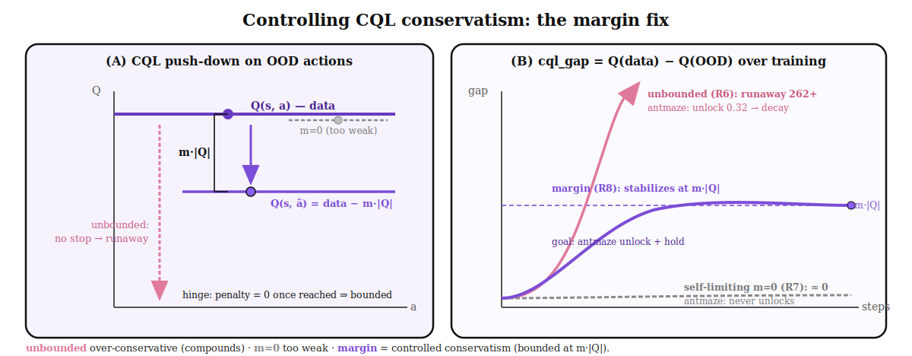

# DQL — Margin-Controlled Conservative Critic (CQL fix)



*Figure 1. Controlling CQL conservatism. **(A)** On the `Q(s,a)` landscape, the CQL term pushes
OOD-Q **down**; the **margin `m`** sets a target `m·|Q|` below data-Q, and the **hinge** stops the
penalty once reached (bounded). Contrast: `m=0` leaves OOD ≈ data (too weak) and the unbounded form
never stops (runaway). **(B)** `cql_gap = Q(data) − Q(OOD)` over training: the **unbounded** form (R6)
runs away (→262+) — antmaze unlocks 0.32 then decays; **self-limiting `m=0`** (R7) stays ≈0 — antmaze
never unlocks; the **margin** form (R8) stabilizes at `m·|Q|` — the goal being antmaze unlock **and**
hold.*

## Problem (measured across rounds)
CQL is the right lever (it unlocked antmaze — the first non-zero DQL result), but its *strength*
must be controlled. Two failure modes bracket the answer:

| CQL form | `cql_gap` behavior | antmaze |
|---|---|---|
| **R6 unbounded** `α(Q_ood − Q_data)` | **runs away** (→ 262 / 931) | **0.32 @50k**, then **decays** to ~0.06 |
| **R7 self-limiting** `α·relu(Q_ood − Q_data)/\|Q\|` | bounded ~0 | **never unlocks** (0.0) |

- R6: strong early conservatism (OOD-Q pushed *well below* data-Q, gap ~10–30) → **unlocks** antmaze,
  but the unbounded penalty **compounds** → over-conservative → decay.
- R7: the hinge stops at `Q_ood ≈ Q_data` (gap ~0) → **too weak** → antmaze never unlocks.

**Root insight:** we need OOD-Q a *controlled amount below* data-Q — not `0`, not `∞`.

## Fix: a conservatism **margin**
```
cql = α_cql · relu( Q_ood − Q_data + m·|Q| ) / |Q|          # equilibrium:  gap = Q_data − Q_ood = m·|Q|
```
- The **hinge** kills the runaway (penalty = 0 once `Q_ood ≤ Q_data − m·|Q|`).
- The **margin `m > 0`** forces OOD-Q a fixed fraction of `|Q|` below data → **conservative enough**.
- `|Q|`-normalization makes `m` **scale-free**; the gap self-stabilizes at `m·|Q|` (bounded).

For antmaze `|Q|≈80`: `m ∈ {0.1, 0.2, 0.3} → gap ≈ {8, 16, 24}` — exactly the range that unlocked
antmaze in R6 (before it ran away).

## Why this should work
It reproduces R6's *unlocking* conservatism (a real gap below data) **without** R6's *compounding*
(the hinge caps it). So it should get antmaze's 0.32 **and hold it** (no decay), and give cube a
correctly-conservative critic that isn't crushed (R6 cube gap 262 → controlled `m·|Q|`).

## Plan
- **Sweep `m ∈ {0.1, 0.2, 0.3}` on antmaze** (fast, decisive — it shows a signal by 50k).
- **Verify:** (a) `cql_gap` stabilizes near `m·|Q|` (bounded, not 262); (b) antmaze **unlocks and holds**.
- **Then:** apply the winning `m` to cube (the RQL-collapse regime) for the headline comparison.

## Honest caveat
If antmaze unlocks but *still* decays with a bounded gap, the decay is **not** over-conservatism —
it's a separate instability (drift / critic / bounded-ascent), which we'd chase next. The margin
sweep cleanly separates these: bounded gap + no decay ⇒ fixed; bounded gap + decay ⇒ different cause.
