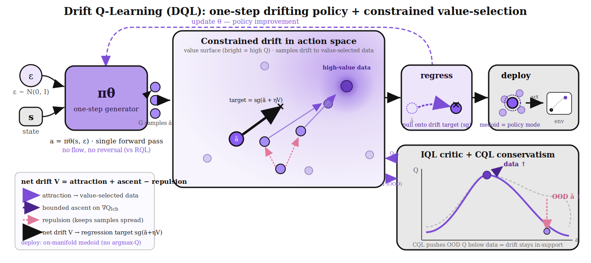

# DQL — Constrained Drift Actor + CQL-Conservative Critic



*Figure 1. The DQL pipeline. **Actor:** a one-step generator `π_θ(s,ε)` produces `G` action samples
in a single forward pass (no flow / no reversal, vs RQL); improvement is a **constrained drift** in
action space — attraction toward **value-selected in-support data actions** (trust region) +
generator-sample repulsion (multimodality) + a **bounded unit-norm ascent on `Q_lcb`**, regressed
gradient-free toward the stop-gradded target, deployed on-manifold via the medoid (no `argmax-Q`).
**Critic:** IQL with **CQL conservatism** — the ensemble LCB `Q_lcb = mean_i Q_i − ρ·std_i Q_i`
scores candidates/ascent, while the CQL term pushes `Q` **down on generator (OOD) actions `ã` and up
on data actions `a`**, flattening the shared-ensemble overestimation the LCB alone cannot catch.
**Coupling:** the generator's samples `ã` feed the critic as CQL OOD negatives; `Q_lcb` feeds the
drift's selection and ascent.*

## Motivation (measured, not guessed)
Every DQL variant so far either overestimated or had no improvement signal. The calibration
probe (`diagnostics/calibration_probe.py`) pinned it with hard numbers:

| quantity | value |
|---|---|
| realized discounted return | −198.7 |
| predicted `Q(s0,a0)` | −158.3 |
| **overestimation gap** | **+40.4** (LCB closes only 0.5) |
| ens-std chosen vs data | 2.27 vs 1.01 |

And the improvement-mechanism comparison on cube-double:

| mechanism | peak | behavior |
|---|---|---|
| gradient (`∇Q` ascent, `q_coef`) | 0.16–0.18 | **only thing off 0**, but UNSTABLE (chases the +40 overestimate) |
| gradient-free (value-selection drift) | **0.00** | no improvement signal |
| RQL (reference) | 0.38 | stable |

**Conclusion.** The `∇Q` gradient is the *only* source of real improvement; it is unstable **only
because it is unconstrained**. RQL is stable because it *constrains* the same gradient:
(#1) a **bounded** flow-step `min(1/fs, 1−t)`, (#2) value evaluated **on the noise→data interp path**,
(#3) a strong **α·BC trust region**, (#4) **LCB + on-manifold** (reversal) value. Our early `q_coef`
had only (#4) → it walked straight into the overestimated OOD region.

## Method — constrained Q-ascent for the one-step actor (`agents/dql.py::actor_loss`)
Drift `V = S_p − S_q + q_step · ŝ`, regressed gradient-free-style via `‖gen − sg(gen + drift_step·V)‖²`:
- **`S_p` (trust region, #3):** normalized mean-shift toward **value-selected in-support data actions**
  — candidates are the **top-M nearest states'** actions, reweighted by
  `softmax_m( zscore[Q_lcb(s_i, a_m)]/α − ‖s_i−s_m‖²/bw )`. Keeps the policy on the behavior manifold.
- **`ŝ` (bounded ascent, #1/#2):** `q_step · ∇_a Q_lcb / ‖∇_a Q_lcb‖` — a **unit-norm (bounded)** step up
  the value, evaluated locally at `gen` (near-data via the trust region). `q_step=0` ⇒ gradient-free.
- **`Q_lcb` (#4):** `mean − ρ·std` over a 10-member ensemble everywhere the critic is queried
  (selection, ascent, eval, bootstrap).
- **`S_q`:** repulsion over generator samples → multimodality.
- **Deployment:** on-manifold — medoid of K generator samples (no `argmax-Q` over OOD).

### Critic: IQL + CQL conservatism (the fix that made it work)
The LCB alone cannot remove overestimation because the bias is **correlated across the ensemble**
(calibration: gap `+40`, LCB closes only `0.5`). We therefore add a **CQL** term to the critic:
```
L_critic = TD_loss  +  α_cql · ( E_{ã∼π_θ}[Q(s, ã)]  −  E_{a∼data}[Q(s, a)] )
```
which pushes `Q` **down on the generator's OOD actions and up on data actions** — the generator's
own samples serve as the OOD negatives. This flattens the overestimation bump at the source, so
the value-selection and bounded ascent (which both read `Q`) stop chasing fake-high-`Q` actions and
the policy stays on the in-support manifold. Calibration confirms it: gap collapses `40→23→17→12`
for `α_cql = 1→3→10`, and at `α_cql=10` the deployed actions are back in-support
(ens-std `1.03 ≈ 1.09` at data). This unlocked the first non-zero result (antmaze).

## Algorithm (one update step; `agents/dql.py`)
Notation: batch of states/data-actions `{(s_i, a_i)}_{i=1..B}`, `G` generator samples,
`M` = top-M nearest-state candidates, kernel `k_τ(x,y)=exp(−‖x−y‖²/2τ²)`, `Q_lcb = mean_i Q_i − ρ·std_i Q_i`.

1. **Critic (IQL + CQL).** `V(s) ← expectile_τ( Q_lcb^target(s, a) )`; `Q(s,a) ← r + γ^h V(s')` (h-step for chunks); **plus** `α_cql·( E_{ã∼π}[Q(s,ã)] − E_data[Q(s,a)] )` to push OOD-Q down / data-Q up. No policy in the TD target ⇒ stable base timescale; CQL removes the OOD overestimation the LCB cannot.
2. **Candidates (top-M, on-manifold).** For each `s_i`, take the `M` nearest states' data actions `{a_m}` (far states get ~0 weight; cost `B·M`, not `B·B`). Evaluate `Q_lcb(s_i, a_m)`.
3. **Value-selection weights (trust region).** `w_{i,m} = softmax_m( z_m[Q_lcb(s_i,a_m)]/α − ‖s_i−s_m‖²/bw )` — z-scored per state (scale-free) × state-proximity. Supported on in-support data actions.
4. **Generate.** `ã_{i,g} = π_θ(s_i, ε_g)`, `ε_g ~ N(0,I)` (stop-grad copy for the drift target).
5. **Drift field** `V_{i,g} = S_p − S_q + q_step·ŝ`:
   - `S_p` (attraction): normalized mean-shift `Σ_m k_τ(ã,a_m) w_{i,m} a_m / Σ_m k_τ w  −  ã`.
   - `S_q` (repulsion): normalized mean-shift over the other generator samples (multimodality).
   - `ŝ` (bounded ascent): `∇_a Q_lcb(s_i,ã) / ‖∇_a Q_lcb‖` — unit-norm, LCB, evaluated at `ã`.
6. **Gradient-free regression.** `L_actor = E‖ π_θ(s,ε) − sg(π_θ(s,ε) + η·V) ‖²` (η = `drift_step`). Grad flows only through the current sample; the target is stopped ⇒ a projected drift step, no backprop through a sampling chain.
7. **Deploy (on-manifold).** action = medoid of `K` generator samples (policy mode) — no critic re-selection.

Constraints map to RQL's four: **#3 trust region** = step 3 (attraction to data); **#1 bounded / #2 near-data** = step 5 `ŝ` (unit step, local); **#4 pessimism** = `Q_lcb` everywhere. `q_step=0` recovers the pure gradient-free drift.

## Compute / speed (RQL-alignment preserved)
The value-selection is the cost driver. It is now **B×M** (top-M nearest-state candidates,
`n_cand=32`), not **B×B** — a near-lossless ~8× reduction (far states already get ~0 softmax weight).
This is safe for the RQL comparison because RQL has *no* candidate-selection at all, so trimming
ours changes **no** shared hyperparameter. We keep `ensemble_ct=10` (matches RQL — do NOT drop it).
Note DQL is still costlier per step than RQL by design (RQL improves via an O(B) flow-gradient;
DQL does O(B·M) candidate value-selection + a bounded ascent) — this should be reported honestly.

## Plan
- **Gate:** calibration probe — expect the +40 gap to stay small (bounded, in-support ascent) *and*
  success to climb (the ascent supplies real improvement).
- **Run:** full 1M — cube (q_step ablation 0.3 / 0.6) + antmaze, vs RQL.
- **Success:** cube climbs toward/past RQL's 0.38 **without** the decay the unconstrained `q_coef` showed.

## Honest caveat
Antmaze may still lag (its critic gradient is action-flat), and on-manifold caps at the best
in-support actions — the RQL/IQL ceiling, which is the target. The bet is that *gradient (improvement)
+ trust region (stability)* — the one quadrant we hadn't tried, and the one RQL proves works — moves
cube from unstable-0.16 toward stable-higher.
