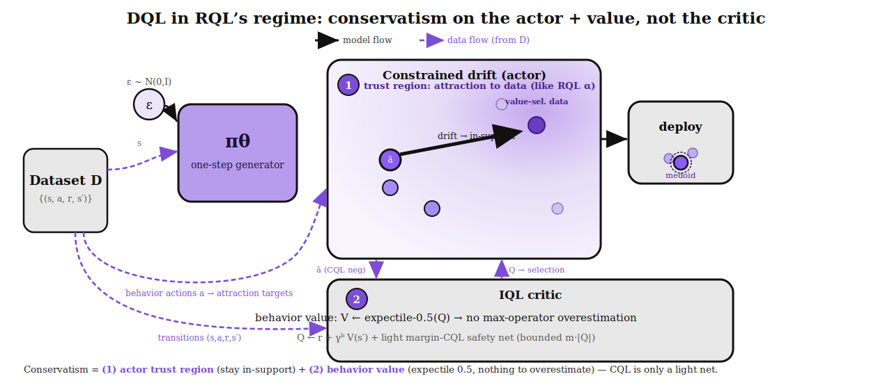

# DQL — Adopt RQL's Conservatism Regime (behavior-value critic + trust region + light margin-CQL)

*Figure 1. DQL data & model flow in RQL's regime. **Model flow** (black): `ε,s → π_θ → constrained
drift → deploy (medoid)`. **Data flow** (dashed purple, from Dataset D): states `s` to the generator;
**behavior actions `a` as the drift's attraction targets**; **transitions to the critic's TD**; and
the generator's samples `ã` to the critic as CQL negatives. The two conservatism sources are
highlighted: **① actor trust region** (attraction to in-support data — DQL's analog of RQL's `α`) and
**② behavior-value critic** (`V ← expectile-0.5(Q)` — no max-operator overestimation to fight). CQL is
only a **light, bounded safety net**, not the brittle main lever.*

## Why (the diagnosis, distilled)
CQL is a *compensation* for an overestimating critic, and compensations are brittle: the sweet spot
between "too small (not learning)" and "too large (diverges)" is narrow, and CQL strength **compounds
over training**. Every round confirmed this: R6 unbounded unlocked antmaze (0.32) then ran away →
decay; R7 self-limiting was bounded but too weak → never unlocked.

RQL never has this problem because it **never queries the value far off the data manifold**:
- **`α` (flow-BC weight) = trust region.** antmaze `0.1` (weak leash, allow stitching) → cube-double
  `10` (strong leash, stay near multimodal data). *This is RQL's main conservatism knob — on the policy.*
- **`expectile`** = value optimism. antmaze `0.5` = **behavior value** (SARSA; zero max-overestimation);
  manip `0.7–0.9` = mild optimism.
- **`ρ = 0.5`** = mild ensemble-LCB safety margin (`0.0` when unneeded).

## Recommendation (what we change)
Stop making CQL the main lever. Move conservatism to RQL's regime:
1. **`expectile = 0.5` for antmaze** — the critic becomes the *behavior value*, so there is **no
   overestimation to fight** (removes the +40 gap at its source, not by penalty).
2. **Corrected, bounded margin-CQL as a light safety net** — fix the R8 bug (drop the `/|Q|` that made
   it too weak): `cql = α_cql · relu( Q_ood − Q_data + m·|Q| )`. The hinge caps the gap at `m·|Q|`
   (no runaway); `m` is small (a safety net, not the driver).
3. Keep the **actor trust region** (drift attraction to in-support data) — DQL's analog of RQL's `α`.

## Plan
- **Relaunch antmaze** with `expectile = 0.5` + corrected margin-CQL, sweeping `m ∈ {0.1, 0.2, 0.3}`.
- **Verify:** (a) `cql_gap` now actually reaches `~m·|Q|` (the fix works); (b) antmaze **unlocks and
  holds** — because the value is the behavior value (no overestimation) and CQL is just a light net.
- **Then:** apply the winning setting to cube (with `expectile ≈ 0.9` per RQL's manip regime).

## Success / falsification
- **Win:** antmaze unlocks (~0.3+) and **holds** (no decay) with a bounded gap — conservatism is now
  a broad band, not a knife-edge.
- **Falsified:** if antmaze *still* decays even with the behavior value + bounded CQL, the decay is a
  distinct instability (drift/ascent), not conservatism — and we chase that instead.
