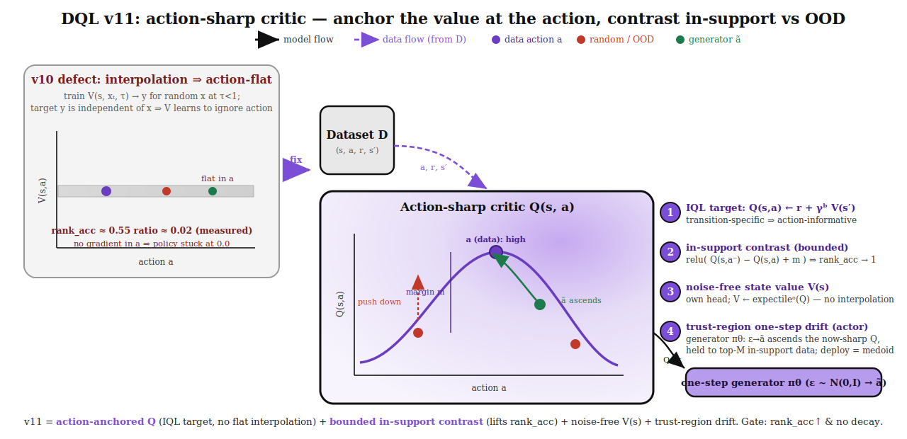
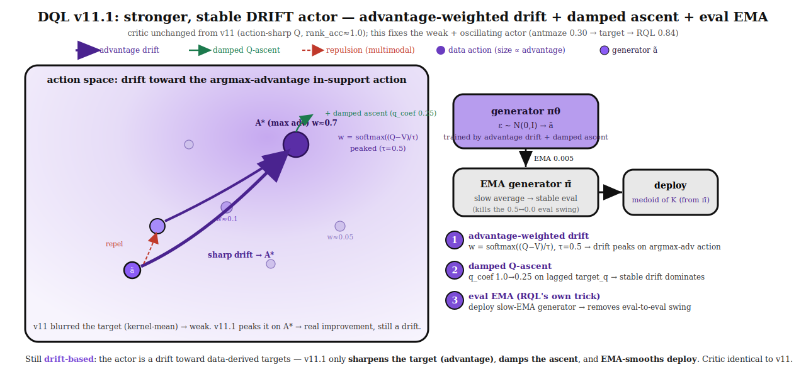
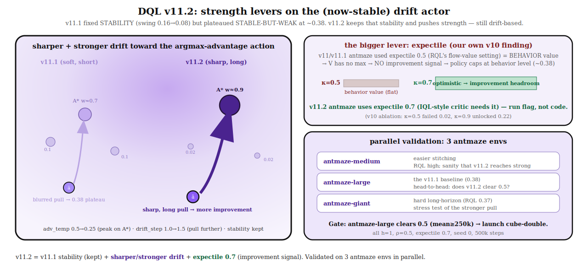

# DQL v11 — Action-sharp critic (anchor the value at the action, contrast in-support vs OOD)



*Figure. **Left:** the measured v10 defect — training `V(s, x_τ, τ) → y` for random `x` at every
`τ<1`, where the target `y` is independent of `x`, teaches the critic to **ignore the action**
(flat value; `rank_acc ≈ 0.55`, `ratio ≈ 0.02`). **Right:** v11 replaces the flat interpolation with
an **action-anchored `Q(s,a)`** (IQL transition target → action-informative by construction) plus a
**bounded in-support contrast** that lifts the data action above OOD/random by a margin `m`
(`rank_acc → 1`), a **noise-free state value `V(s)`**, and a **trust-region one-step drift** actor that
ascends the now-sharp `Q` while staying in-support.*

## Why (the diagnosis that forced this)
A 50k probe run (`probe/rank_acc`, `probe/ratio = act_spread/state_spread`) confirmed v10's critic is
**structurally action-flat and gets worse over training**:

| step | rank_acc | ratio | Vd−Vr |
|---:|---:|---:|---:|
| 17.5k | 0.63 (peak) | 0.086 | +0.65 |
| 50k | 0.57 | **0.022** | +0.19 |

`ratio → 0.02` means `V` varies ~45× more across **states** than **actions**. Root cause: v10's
geometric interpolation trains the value at random `x` for all `τ<1` toward an `x`-independent target,
which **actively regularizes the network to be action-invariant**. The τ=1 action signal is
measure-zero against it. A critic that can't rank actions gives the policy no gradient → **0.0 success
through 600k** on cube-double/triple/quadruple.

## What changes (v11)
Keep everything that was **healthy** in v10 (no overestimation, no mode-collapse, no actor drift,
one-step deploy) and fix the **one** broken thing (action-informativeness):

1. **Drop the interpolation coordinate.** The critic is a genuine action value `Q(s,a)` trained with the
   **IQL transition target** `Q(s,a) ← r + γ^h V(s')`. Because the target is transition-specific, `Q` is
   action-informative *by construction* (the same reason IQL/RQL critics are).
2. **Bounded in-support contrast (the anti-flatness lever).** A margin hinge
   `L_c = mean relu( Q(s, a⁻) − Q(s, a_data) + m )` over negatives `a⁻ ∈ {random, generator}` forces
   `Q(s, a_data) ≥ Q(s, a⁻) + m` → **directly lifts `rank_acc`** and simultaneously **pushes OOD `Q`
   down** (so the actor's Q-ascent cannot run away into OOD — the failure that made earlier CQL brittle).
   The hinge is bounded (caps at `m`), so no runaway/divergence.
3. **Noise-free state value `V(s)`** as its own head: `V(s) ← expectile_κ(Q(s, a_data))`. No
   marginalization trick needed (that existed only to extract a state value from the interpolation net).
4. **Trust-region one-step drift actor (unchanged from v10):** value-selection drift toward top-M
   in-support data + repulsion, plus bounded Q-ascent — now driven by the **action-sharp `Q`**. Deploy =
   one forward pass (medoid).

## Success criterion / falsification (measurable *before* the eval lands)
- **Leading indicator (new):** `probe/rank_acc` must climb toward **≥ 0.8** and `probe/ratio` must
  **grow** (critic uses the action). If the contrast can't lift `rank_acc` within ~30k without `Q`
  diverging, the flatness is not fixable by a bolt-on contrast and the deeper coupling (RQL-style
  flow) is required — we learn that in 30 min, not 12 h.
- **Outcome:** cube-double breaks off 0.0 and **holds ≥ 23 (beat RQL)**; stretch **≥ 74 (beat all)**.
- **Guardrail:** watch `Vd−Vg` (was negative in v10 = generator gaming a flat critic). It should go
  **positive** (data ≥ generator) once the contrast bites.

## Plan
- Relaunch cube-double first; **gate on `probe/rank_acc` at 30k** before committing cube-triple /
  cube-quadruple. If the gate passes, launch all three (GPU has room) to 1M with 50k evals.

---

# v11 results & the v11.1 actor fix

## What v11 actually showed (measured)
The gate passed decisively and the critic fix held all the way — **but the eval told a two-part story**:

| | critic (probe) | eval outcome |
|---|---|---|
| **v11 critic** | `rank_acc → 1.0` and **holds**; `Vd−Vg ≈ 0` (calibrated) | — |
| **cube-double** | sharp | **0.0 through 500k** (RQL 23). Deploy ablation (medoid / argmax-Q / robust-Q) **all 0.0** → not deploy. |
| **antmaze-large** | sharp | **climbs to ~0.30 mean (max 0.50) but wildly unstable** (0.50→0.00→0.50 between evals) vs RQL 0.84 stable. |

**Diagnosis:** the v10→v11 **critic** fix is real and validated. The remaining failure is entirely in the
**drift actor**: (a) it does *weak* improvement — the value-selection drift kernel-**averages** the top-M
candidates, blurring the best action into a mediocre mean; and (b) it is *unstable* — the raw Q-ascent
(`q_coef=1.0`) keeps pushing the generator into exploitable critic directions, and with **no eval EMA**
the deployed policy oscillates. It is **not** a critic problem and **not** a deploy problem.

## v11.1 — stronger, stable drift actor (still drift-based)



*Figure. The **critic is identical to v11**. Three changes to the **drift** actor, each targeting one measured
failure: **①** the drift target is **advantage-weighted** — attraction weights `w = softmax((Q−V)/τ)` with a
sharp `τ=0.5`, so the drift peaks toward the **argmax-advantage in-support action** instead of the blurred
Q-mean (real improvement, still a drift; multimodality preserved by the per-sample kernel + repulsion). **②**
the **Q-ascent is damped** (`q_coef 1.0 → 0.25`, on the lagged `target_q`) so the stable in-support drift
dominates and can't oscillate the policy. **③** deploy from a **slow EMA of the generator** (`actor_ema=0.005`)
— the RQL paper's own stability trick, which v11 lacked — removing the eval-to-eval swing.*

### Changes (concise)
1. **Advantage-weighted drift (badge ①).** `v_state = V(s)`; `adv = Q(s,a_cand) − v_state`; scale-free
   `adv_n = adv / mean|adv|`; `w = softmax(adv_n / adv_temp − sq_sel / bw)`, `adv_temp = 0.5`. Replaces v11's
   `softmax(q_normalized / alpha − …)`. Same drift machinery (per-sample kernel attraction + repulsion),
   just a **peaked, advantage-based** target.
2. **Damped Q-ascent (badge ②).** `actor_loss = drift_coef·drift_loss − q_coef·q_asc`, `q_coef = 0.25`
   (was 1.0), `q_asc` on `target_q` (stop-grad params, grad → gen only).
3. **Eval EMA (badge ③).** New `target_actor` module, updated each step by
   `θ̄ ← 0.005·θ + 0.995·θ̄`; `sample_actions` deploys `target_actor` (medoid of K).
4. **Critic unchanged** — IQL Q + bounded in-support contrast + noise-free `V(s)`.

### Success criterion / falsification (vs v11's own numbers)
- **Win:** antmaze **plateau ≳ 0.5 AND smooth** (consecutive-eval swing ≪ v11's ±0.5) — the fixes bought
  both strength and stability; then it earns a cube-double run.
- **Partial:** stability improves (EMA works) but plateau stays ~0.3 → the drift is *stable but still weak*;
  next lever is `adv_temp`↓ / `drift_step`↑ (sharper/stronger pull).
- **Falsified:** no better than v11 → the one-step drift actor caps out here and the improvement must come
  from a multi-step generator (i.e. the RQL-style capacity we set out to avoid).

### Plan
- **Validate on antmaze first** (h=1, expectile=0.5) against v11's 0.30/unstable baseline — cheap, ~decisive.
- Only if antmaze clears the win bar do we spend GPU on cube-double.

---

# v11.1 results & the v11.2 strength lever

## What v11.1 showed (measured, antmaze-large vs v11)
| step | v11 | **v11.1** |
|---:|---:|---:|
| 100k | 0.10 | 0.17 |
| 150k | 0.10 | 0.43 |
| 250k | 0.10 | 0.43 |
| 300k | 0.50 | 0.40 |
| 350k | 0.37 | 0.27 |
| **mean ≥250k** | 0.30 | **0.38** |
| **swing (std, ≥100k)** | 0.162 | **0.082** |

**Split result:** ✅ **stability fully solved** (swing halved, no crashes — the damped ascent + EMA worked)
but ⚠️ **strength only partial** — v11.1 plateaus **stable-but-weak at ~0.38** and does **not** clear 0.5
(RQL 0.84). The advantage drift converges to a modest in-support policy and stops improving.

## v11.2 — strength levers (still drift-based)



*Figure. v11.2 keeps every stability mechanism from v11.1 and pushes **strength** three ways. **Left:** a
**sharper** advantage weight (`adv_temp 0.5→0.25`, peaks ~0.9 on the argmax-advantage action vs ~0.7) and a
**stronger** pull (`drift_step 1.0→1.5`), so the generator is dragged decisively onto the best in-support
action instead of a soft blend. **Right-top — the bigger lever:** v11/v11.1 antmaze used **expectile 0.5**
(copied from RQL's flow-value regime) = a **behavior value** with no max, hence **no improvement signal** —
which is almost certainly why they capped at behavior level ~0.38. Our own **v10 ablation** proved
`κ=0.5→0.02` (fails) vs `κ=0.9→0.22` (unlocks). An IQL-style critic needs an **optimistic expectile**;
v11.2 antmaze uses **`κ=0.7`**. **Right-bottom:** validated on **3 antmaze envs in parallel**.*

### Changes (concise)
1. **Sharper advantage drift:** `adv_temp` 0.5 → **0.25** (code default).
2. **Stronger pull:** `drift_step` 1.0 → **1.5** (code default).
3. **Expectile correction:** antmaze runs at **`expectile 0.7`** (run flag; v11/v11.1 used 0.5) — the
   likely dominant fix, restoring an improvement signal to the IQL-style value.
4. **Stability machinery unchanged** — damped Q-ascent (`q_coef=0.25`) + eval EMA (`actor_ema=0.005`).

### Parallel 3-env validation
All `h=1, ρ=0.5, expectile=0.7, seed 0, 500k`:
- **antmaze-medium** — easier stitching (RQL high) → sanity that v11.2 can reach *strong*, not just 0.4.
- **antmaze-large** — the v11.1 head-to-head baseline (0.38): **does v11.2 clear 0.5?**
- **antmaze-giant** — hard long-horizon (RQL 0.37) → stress test of the stronger pull.

### Success / gate
- **Win:** antmaze-large **mean(≥250k) ≥ 0.5** (and medium clearly strong) → **launch cube-double next**.
- **Partial:** medium strong but large still ~0.4 → the cap is large-specific (harder stitching), not the recipe.
- **Falsified:** all three still ~v11.1 → strength doesn't come from these levers; the one-step drift caps out.

---

# v11.2 — formal method specification & propositions (for external proof validation)

*Self-contained specification of the v11.2 algorithm exactly as implemented in
`agents/dql_v11_2.py`, followed by the propositions we want proved/refuted and the open
questions for the prover. Companion framing: `DQL_THEORY.md` (§3–§4 derive the idealized
drift-as-Wasserstein-gradient-flow picture; this section states what the code *actually*
computes, which differs in three places flagged below).*

## S1. Setup and notation

Offline RL. Dataset `D = {(s_t, a_t, r_t, s_{t+1})}` from behavior policy `μ(·|s)`.
Actions are **chunks**: `a ∈ R^{hd}` is `h` consecutive atomic actions flattened
(`h=1` locomotion, `h=5` manipulation). Symbols:

| symbol | meaning | code value |
|---|---|---|
| `Q_e(s,a)`, `e=1..E` | critic ensemble (+ EMA target copy `Q̄_e`) | `E=10` |
| `V(s)` | state-value net (mean of 2 heads) | — |
| `π_θ(s,ε)`, `ε~N(0,I)` | one-step generator policy; pushforward `q_θ(·|s)` | — |
| `π_θ̄` | slow EMA of generator (deployment policy) | `λ=0.005` |
| `Q_LCB(s,a)` | `mean_e Q_e − ρ·std_e Q_e` | `ρ ∈ {0, 0.5}` |
| `κ` | expectile | `0.7` locomotion / `0.7–0.9` manip |
| `τ_adv` | advantage-softmax temperature | **0.25** (v11.1: 0.5) |
| `η` | drift step size | **1.5** (v11.1: 1.0) |
| `c_q` | damped Q-ascent weight | `0.25` |
| `γ, m` | discount, contrast margin | `0.99/0.995`, `1.0` |

## S2. Critic (unchanged from v11)

Per batch `{(s_i, a_i, r_{i,0..h-1}, s_i')}` (`s'` is the state `h` steps ahead;
within-chunk terminals mask the reward sum and invalidate crossing chunks):

```
L_V  = E_i [ |κ − 1{Δ_i < 0}| · Δ_i² ],     Δ_i = mean_e Q̄_e(s_i, a_i) − V(s_i)      (V1)
y_i  = Σ_{j<h} γ^j r_{i,j} + γ^h V(s_i')                                              (V2)
L_Q  = E_{i,e} [ (Q_e(s_i, a_i) − y_i)² · valid_i ]                                   (V3)
L_C  = E_{i,n} [ relu( mean_e Q_e(s_i, a_n^−) − mean_e Q_e(s_i, a_i) + m ) ]          (V4)
L_critic = L_Q + L_V + L_C
```

Negatives `a^−` in (V4): `N_r=8` uniform-random actions + `G=16` stop-gradient generator
samples. Note (V1)–(V2) is IQL with an `h`-step backup: **no policy in the TD target**.

## S3. Actor: advantage-weighted drift + damped ascent

For each batch state `s_i`, draw `G` generator samples `g_k = π_θ(s_i, ε_k)` and select
`M=32` in-batch nearest-neighbor states `j ∈ NN_M(s_i)` with data actions `a_j`.

**(a) Attraction weights** (self-normalized, scale-free advantage):

```
A_j  = Q_LCB^target(s_i, a_j) − V(s_i);       Â_j = A_j / E|A|                        (A1)
w_j  = softmax_j( Â_j / τ_adv  −  ‖s_i − s_j‖² / b ),   b = state_bw · E‖Δs‖²         (A2)
```

**(b) Drift field** — difference of two Nadaraya–Watson means with Gaussian action
kernel `k(x,y) = exp(−‖x−y‖²/2τ²)`, adaptive `τ² = tau_scale · E‖Δa‖²`:

```
m_p(g) = Σ_j k(g,a_j) w_j a_j / Σ_j k(g,a_j) w_j        (attraction: toward data)     (A3)
m_q(g) = Σ_{k'≠k} k(g,g_{k'}) g_{k'} / Σ_{k'≠k} k(g,g_{k'})   (repulsion: own samples) (A4)
V_drift(g) = m_p(g) − m_q(g)                                                          (A5)
```

**(c) Losses** (`sg` = stop-gradient; gradients reach `θ` only through `π_θ` outputs):

```
L_drift = E_{i,k} ‖ g_k − sg( g_k + η · V_drift(g_k) ) ‖²                             (A6)
L_asc   = − E_{i,k} [ Q_LCB^target(s_i, g_k) ]          (target-Q params frozen)      (A7)
L_actor = L_drift + c_q · L_asc                                                       (A8)
```

**(d) Updates & deployment.** Adam on `L_critic + L_actor`; Polyak targets
(`Q̄: 0.005`, `θ̄: λ=0.005`). At eval: draw `K=32` samples from `π_θ̄`, deploy the
**medoid** `argmin_k Σ_{k'} ‖g_k − g_{k'}‖²`.

### Deviations from the idealized theory (`DQL_THEORY.md`) — flag these to the prover
1. **(A3–A5) vs. theory eq. (3):** the code uses *normalized* mean-shift (difference of
   NW means), not the unnormalized field `E[k·(y−x)]`. Mean-shift identity:
   `m_p(g) − g ≈ τ² ∇ log p̂_w(g)`, so `V_drift ≈ τ² ∇ log ( p̂_w / q̂ )(g)` — the same
   score-difference target, but self-normalized (different variance/bias profile).
2. **(A2) vs. theory eq. (8):** weights use a **softmax** of normalized advantage over M
   candidates, i.e. adaptive temperature `α_eff = τ_adv · E|A(s,·)|` and self-normalized
   importance sampling, rather than raw `exp(A/α)`.
3. **(A7) is new vs. the pure drift picture:** a damped explicit ascent term that *does*
   query `Q` at generator (possibly OOD) actions, bounded by `c_q = 0.25`.

## S4. Propositions to validate (prove, bound, or refute)

**P1 (expectile gives an improvement operator; the v11→v11.2 cap fix).**
Define the composite critic operator `T_κ` by (V1)–(V2). For `κ = 0.5`, (V1) is ½·MSE so
`V(s) = E_{a~μ}[mean_e Q̄(s,a)]` and `T_0.5` is the *behavior* (SARSA-style) `h`-step
backup: fixed point `Q^μ`, and `E_{a~μ}[A(s,a)] = 0` — the attraction (A2) then ranks
candidates against the behavior mean but the bootstrap never compounds improvement.
For `κ → 1`, `V(s) →` in-support `max_a Q(s,a)` (IQL, Kostrikov et al. 2022) and `T_κ`
approaches the in-support optimality backup. **Claims to prove:** (i) `T_κ` is a
`γ^h`-contraction for all `κ ∈ (0,1)`; (ii) its fixed point is monotone non-decreasing
in `κ` and interpolates `Q^μ → Q*_supp`; (iii) therefore with `κ = 0.5` the drift target
distribution (S3) equals a *reweighted behavior policy evaluated under `Q^μ`* — one
step of policy improvement, never iterated — predicting the empirically observed
behavior-level plateau (v11/v11.1 antmaze ≈ 0.38 at `κ=0.5`; 0.52–0.73 at `κ=0.7`).

**P2 (softmax blur: why τ_adv matters; the v11.1→v11.2 sharpening).**
As `τ_adv → 0`, `w → ` one-hot on `argmax_j Â_j` (within the state-locality penalty), so
the drift fixed point collapses onto the kernel barycenter of the *single best* in-support
candidate. For finite `τ_adv`, the stationary generator satisfies `m_p(g*) = m_q(g*)`,
and the attraction target is a `w`-blend. **Claim to bound:** the value gap
`Q(s, a_blend) − Q(s, a_argmax)` of the blended target, in terms of `τ_adv`, the advantage
spread over candidates, and the kernel bandwidth — i.e., quantify the "blur bias" that
capped v11.1 (τ_adv=0.5) below v11.2 (τ_adv=0.25). Note the softmax over M
self-normalized weights is an SNIS estimator of the tilted target
`p_w ∝ k_state(s,·) μ(·) exp(A/α_eff)` — bound its bias for finite `M=32`.

**P3 (damped ascent stability: why c_q = 0.25 and not 1.0).**
Model locally: `Q(s,·)` quadratic with curvature `H ⪯ 0` off-support, drift term acting
as a contraction of modulus `(1 − c_d·η·k')` toward the in-support barycenter (`k'` =
effective kernel stiffness). The actor update direction is
`−∇L_actor ∝ c_d·η·V_drift + c_q·∇_a Q`. **Claim to prove:** a sufficient condition of the
form `c_q · ‖H‖ < c_d · η · k'` under which the coupled actor iteration (with EMA target
critic on the slow-drifting `Q̄`) is non-expansive — and that violating it admits limit
cycles (the q_coef=1.0 oscillation observed in v11: eval swing 0.5↔0.0). Derive the
stability margin as a function of `(c_q, η, τ², λ)`.

**P4 (drift consistency with the normalized estimator).**
Prove or refute: with `p̂_w` the `w`-weighted KDE of candidate actions and `q̂` the
leave-one-out KDE of the generator's own samples, `V_drift` of (A5) satisfies
`V_drift(g) = τ² ∇ log(p̂_w/q̂)(g) + O(τ⁴)` under standard smoothness, so (A6) performs a
kernelized Wasserstein gradient step on `KL(q_θ ‖ p_w)` per state — inheriting the
fixed-point/identifiability argument of `DQL_THEORY.md` §3 with `π*` replaced by the
**SNIS-tilted empirical behavior** `p_w`. State precisely how the fixed point differs
from the ideal `π* ∝ μ e^{A/α}` (finite M, state-kernel bias, self-normalization).

**P5 (EMA deployment).**
Show the actor EMA `θ̄` (i) leaves the set of stationary points of (A8) unchanged, and
(ii) reduces the variance of the deployed policy's parameters by the standard factor
`λ/(2−λ)` for stationary parameter noise — matching the measured eval-swing reduction
(0.162 → 0.082). Also characterize the **medoid** selection over `K=32` samples as a
mode-seeking projection of `q_θ̄`: under a mixture model, when does it provably select
the highest-mass mode, and what success-rate gap vs. sampling can this create?

**P6 (contrast term compatibility).**
(V4) pushes `Q` down on generator samples while (A7) pushes the generator up `Q` — a
minimax coupling. Show that with margin `m` and `c_q` bounded as in P3 this admits no
degenerate equilibrium where the generator parks in the contrast's blind spot
(`Q(data) − Q(gen) ≥ m` exactly), or exhibit the condition under which it does.

## S5. Training-step pseudocode (as implemented)

```
# one SGD step; batch = {(s, a_chunk, r_0..h-1, s_plus_h, terminals, masks)}
def update(batch):
    # ---- critic ----
    Δ      = mean_e(Q̄_e(s, a_data)) − V(s)
    L_V    = mean( |κ − 1{Δ<0}| · Δ² )
    y      = Σ_{j<h} γ^j r_j (terminal-masked) + γ^h V(s')          # sg
    L_Q    = mean_e mean( (Q_e(s, a_data) − y)² · valid )
    g_1..G = π_θ(s, ε_k),  ε_k ~ N(0,I)                              # G=16
    a_neg  = {uniform(−1,1)}^{N_r=8} ∪ sg({g_k})
    L_C    = mean( relu( Q(s, a_neg) − Q(s, a_data) + m ) )

    # ---- actor ----
    NN     = M=32 nearest in-batch states to s;  a_j = their data chunks
    Â_j    = ( Q_LCB^tgt(s, a_j) − V(s) ) / E|A|                     # sg
    w      = softmax_j( Â_j/τ_adv − ‖s−s_j‖²/b )                     # sg
    m_p(g) = NW-mean of {a_j} under k(g,·)·w                         # attraction
    m_q(g) = NW-mean of {g_k'≠k} under k(g,·)                        # repulsion
    L_drift= mean_k ‖ g_k − sg(g_k + η·(m_p−m_q)(g_k)) ‖²
    L_asc  = − mean_k Q_LCB^tgt(s, g_k)                              # grad→θ only
    adam_step( L_Q + L_V + L_C + L_drift + c_q·L_asc )

    Q̄ ← 0.005·Q + 0.995·Q̄ ;   θ̄ ← 0.005·θ + 0.995·θ̄

def deploy(s):                       # evaluation
    g_1..K = π_θ̄(s, ε_k), K=32
    return argmin_k Σ_k' ‖g_k − g_k'‖²          # medoid
```

## S6. Empirical anchors the theory must be consistent with

| observation | run | where |
|---|---|---|
| `κ=0.5` caps at behavior level (~0.38 antmaze-large); `κ=0.7` breaks the cap | v11.1/v11.2 | Experiment.md |
| `τ_adv 0.5→0.25, η 1.0→1.5`: antmaze-large 0.38 → **0.73**@100k | v11.2 pilot | above |
| `c_q=1.0` oscillates (0.5↔0.0 between evals); `c_q=0.25`+EMA: swing 0.162→0.082 | v11→v11.1 | Experiment.md |
| v11.1 (+κ fix) full 50-task sweep, 1M steps, seed 0: overall 16 vs RQL 56 | this repo | RESULTS_DQL111.md |
| critic probe `rank_acc → 1.0` while sparse-manip success stays 0 | v11.x cube | wandb `probe/*` |

**For the prover, in priority order:** P1 (ii)–(iii), P2's blur bound, P3's stability
margin. These three respectively explain the version line's three empirical jumps and
would turn the v11.2 recipe from tuned constants into derived conditions.

## S7. External review corrections & prior-work collision (2026-07-14)

An external technical review of S1–S6 was validated; its factual claims check out. Record:

**Prior work (verified real, all concurrent Apr–Jun 2026):**
- **DriftQL** (arXiv:2606.00350, McGill/Mila): one-step drift actor for offline RL, attraction +
  repulsion + Q-ascent, SOTA claim on D4RL + OGBench. *Owns the name DQL/DriftQL.* Key structural
  difference from us: their attraction is **single-positive** ("offline RL is single-positive by
  construction" -- each state pulls only toward its own dataset action); critic is clipped
  double-Q with standard Bellman backup; Q-ascent undamped.
- **DFP** (arXiv:2605.07727, KAIST): one-step policy as reverse-KL W2 gradient flow toward the soft
  target, top-K critic-selected BC surrogate -- publishes the DQL_THEORY.md framing.
- Also: Drift-Based Policy Optimization (2604.03540), Positive-Only Drifting PO (2604.16519).

**Our remaining defensible deltas:** (1) *multi-positive, state-local (kNN), advantage-tilted*
attraction -- a direct counterpoint to DriftQL's single-positive premise, and the mechanism that
enables stitching; (2) optimistic expectile critic with h-step chunked backups (+LCB/contrast)
instead of double-Q, i.e. in-support recursive improvement propagation; (3) damped-ascent
stability + finite-sample blur analysis as theory. Rename the method (avoid DQL/DriftQL).

**Corrections to S4 (accepted):**
- **P1(iii) as stated is wrong.** kappa=0.5 does NOT eliminate improvement: one step of exponential
  tilting of Q^mu is a valid policy-improvement operator (E_{pi_alpha}[Q^mu] >= V^mu). What
  kappa=0.5 removes is *recursive propagation* of improvement through the critic fixed point.
  The 0.38 plateau stays as an observation/hypothesis, not a theorem.
- **P4:** the KDE mean-shift/score identity is exact (no O(tau^4) term), but the normalized field is
  not automatically the exact WGF of a smoothed KL -- soften the claim.
- **P5 medoid is NOT mode-seeking:** sum_l ||g_k - g_l||^2 = K||g_k - g_bar||^2 + const, so our
  eval selector picks the sample *closest to the sample mean* -- for multimodal action
  distributions this can deploy a between-modes compromise action. Candidate contributor to the
  sparse-manipulation zeros (rank_acc ~1 yet success 0). Fix: kernel-density mode selector
  argmax_k sum_{l!=k} exp(-||g_k-g_l||^2 / 2 sigma^2), Q_LCB tie-break. Testable on saved
  checkpoints without retraining.
- **P6 is false in general:** a value margin does not constrain Q-gradients; drift and ascent can
  cancel at a contrastive blind spot. Retract; replace with an empirical probe.
- **Implementation notes:** advantage normalization should be per-state with an explicit epsilon
  floor (current: batch-global mean + 1e-6) and log weight entropy / effective sample size;
  tau_adv is a bias-variance lever, not a pure sharpness win; eta is not the true actor step size
  (Adam preconditioning + generator Jacobian intervene); raw-state kNN is the suspect
  representation for manipulation -- compare critic-representation kNN.
