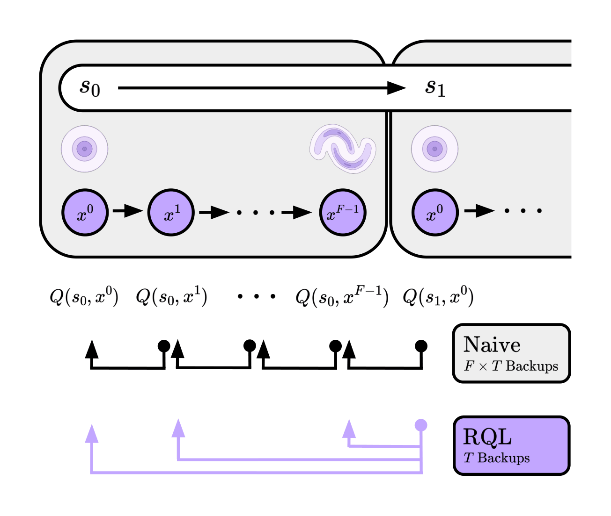

<div align="center">

<div id="user-content-toc" style="margin-bottom: 50px">
  <ul align="center" style="list-style: none;">
    <summary>
      <h1>Reversal Q-Learning (RQL)</h1>
      <div style="height: 2px;"></div>
      <br>
      <h2>Paper</a> &emsp;</h2>
      <h2><a href="https://aober.ai/rql">Website</a> &emsp;</h2>
    </summary>
  </ul>
</div>

</div>




## Installation

RQL requires Python 3.9+ and is based on JAX. The main dependencies are
`jax >= 0.4.26`, `ogbench == 1.2.0`, and `gymnasium == 0.29.1`.
To install the full dependencies, simply run:
```bash
pip install -r requirements.txt
```


## Usage

The main implementation of RQL is in [agents/rql.py](agents/rql.py).

Tuned hyperparameters for each environment and agent are provided in the paper.
Complete list of RQL commands here: [hyperparameters.sh](hyperparameters.sh)

```bash

# RQL

python main.py 
    --agent=agents/rql.py 
    --env_name=humanoidmaze-large-navigate-singletask-v0 
    --agent.alpha=10 
    --agent.expectile=0.9 
    --agent.ensemble_ct=10 
    --agent.rho=0.0 
    --agent.h=1 
    --agent.discount=0.995 
    --offline_steps=1000000 
    --online_steps=0 
    --agent.batch_size=256
```


## Using larger datasets

The paper uses 100m-sized datasets for the OGBench puzzle-4x4 & cube-quadruple environments.
These datasets can be downloaded with the following commands (see [this section of the OGBench repository](https://github.com/seohongpark/ogbench?tab=readme-ov-file#additional-features) for more diverse 100M-sized datasets available):
```bash
# cube-quadruple-play-100m (100 datasets * 1000 length-1000 trajectories).
wget -r -np -nH --cut-dirs=2 -A "*.npz" https://rail.eecs.berkeley.edu/datasets/ogbench/cube-quadruple-play-100m-v0/
# puzzle-4x4-play-100m (100 datasets * 1000 length-1000 trajectories).
wget -r -np -nH --cut-dirs=2 -A "*.npz" https://rail.eecs.berkeley.edu/datasets/ogbench/puzzle-4x4-play-100m-v0/
```

</details>


## Acknowledgments

This codebase is built on top of reference implementations from [Flow Q-Learning](https://github.com/seohongpark/fql).
